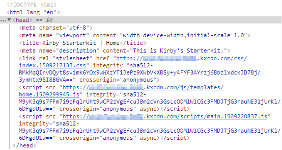

# kirby-sri
This plugin generates base64-encoded cryptographic hashes for your css / js files based on their content and adds them to the `integrity` attribute of their corresponding `<link>` or `<script>` elements.

`kirby-sri` also applies [cache-busting / fingerprinting](#cache-busting--fingerprinting).



**Table of contents**
- [1. What's SRI?](#whats-sri)
- [2. Installation](#installation)
  - [a) Git submodule](#git-submodule)
  - [b) Clone or download](#clone-or-download)
- [3. Usage](#usage)
  - [a) Activation](#activation)
  - [b) Options](#options)
- [4. Cachebusting / fingerprinting](#cache-busting--fingerprinting)
  - [a) Apache](#apache)
  - [b) NGINX](#nginx)
- [4. Be safe - use protection!](#be-safe---use-protection)
- [5. Credits / License](#credits--license)

## What's SRI?
> Subresource Integrity (SRI) is a security feature that enables browsers to verify that files they fetch (for example, from a CDN) are delivered without unexpected manipulation. It works by allowing you to provide a cryptographic hash that a fetched file must match.
> [Mozilla Developer Network](https://developer.mozilla.org/en-US/docs/Web/Security/Subresource_Integrity)

Enter `kirby-sri`: Kirby-side generated SRI hashes for [safer CDN usage](https://hacks.mozilla.org/2015/09/subresource-integrity-in-firefox-43/). Read more about CDN integration and Kirby in the [docs](https://getkirby.com/docs/cookbook/kirby-loves-cdn)) or over at Kirby's partner [KeyCDN](https://www.keycdn.com/support/kirby-cdn-integration/) to get started.

**This plugin only provides hash generation.** For usage with CDNs, refer to Kirby's official [`cdn-plugin`](https://github.com/getkirby-plugins/cdn-plugin)!

## Installation
Use one of the following methods to install & use `kirby-sri`:

### Git submodule

If you know your way around Git, you can download this plugin as a [submodule](https://github.com/blog/2104-working-with-submodules):

```text
git submodule add https://github.com/S1SYPHOS/kirby-sri.git site/plugins/kirby-sri
```

### Clone or download

1. [Clone](https://github.com/S1SYPHOS/kirby-sri.git) or [download](https://github.com/S1SYPHOS/kirby-sri/archive/master.zip)  this repository.
2. Unzip / Move the folder to `site/plugins`.

## Usage
After installing the plugin, you should activate it (if you haven't already, read about [multi-environment setups](https://getkirby.com/docs/developer-guide/configuration/options)) and have a look at its options.

### Activation
Activate the plugin with the following line in your `config.php`:

```text
c::set('sri-hash', true);
```

Kirby's built-in helper functions `css()` and `js()` will now include the `integrity` attribute alongside a matching SRI hash.

### Options
You may configure `kirby-sri` to suit your needs with the following options:

| Option | Type | Default | Description |
| --- | --- | --- | --- |
| `sri-hash.use-credentials` | Boolean | `false` | Sets `crossorigin` attribute to `use-credentials` (default: `anonymous`). |

## Cache-busting / Fingerprinting
[Same old, same old](https://www.keycdn.com/support/what-is-cache-busting/). If anyone comes up with a solution how subresource integrity and cache-busting / fingerprinting could be achieved by different plugins (as all of them modify Kirby's built-in helper functions `css()` and `js()`), feel free to open a PR! Otherwise, follow the next steps:

### Apache
If you're using [Apache](http://httpd.apache.org/) as your webserver, add the following lines to your `.htaccess` (right after `RewriteBase`):

```text
RewriteCond %{REQUEST_FILENAME} !-f
RewriteRule ^(.+)\.([0-9]{10})\.(js|css)$ $1.$3 [L]
```

### NGINX
If you're using [NGINX](https://nginx.org/en/) as your webserver, add the following lines to your virtual host setup:

```text
location /assets {
  if (!-e $request_filename) {
    rewrite "^/(.+)\.([0-9]{10})\.(js|css)$" /$1.$3 break;
  }
}
```

**Note: SRI hash generation & cache-busting are not applied to external URLs!**

## Be safe - use protection!
**Always use https:// URLs** when loading subresources from a CDN, otherwise they might get blocked:

> Mixed content occurs when initial HTML is loaded over a secure HTTPS connection, but other resources (such as images, videos, stylesheets, scripts) are loaded over an insecure HTTP connection. This is called mixed content because both HTTP and HTTPS content are being loaded to display the same page, and the initial request was secure over HTTPS. Modern browsers display warnings about this type of content to indicate to the user that this page contains insecure resources.
> [Google Developers](https://developers.google.com/web/fundamentals/security/prevent-mixed-content/what-is-mixed-content)

## Credits / License
`kirby-sri` was inspired by Kirby plugins [cachebuster](https://github.com/getkirby-plugins/cachebuster-plugin) (by Kirby team members [Bastian Allgeier](https://github.com/bastianallgeier) and [Lukas Bestle](https://github.com/lukasbestle)) as well as [fingerprint](https://github.com/iksi/kirby-fingerprint) (by [Iksi](https://github.com/iksi)). It is licensed under the [MIT License](LICENSE), but **using Kirby in production** requires you to [buy a license](https://getkirby.com/buy). Are you ready for the [next step](https://getkirby.com/next)?

## Special Thanks
I'd like to thank everybody that's making great software - you people are awesome. Also I'm always thankful for feedback and bug reports :)
